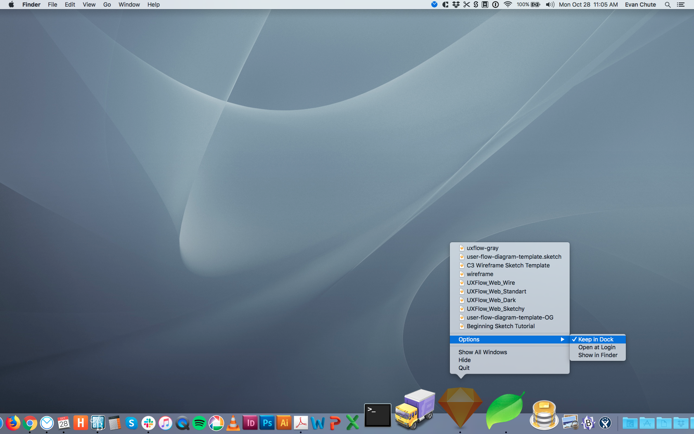
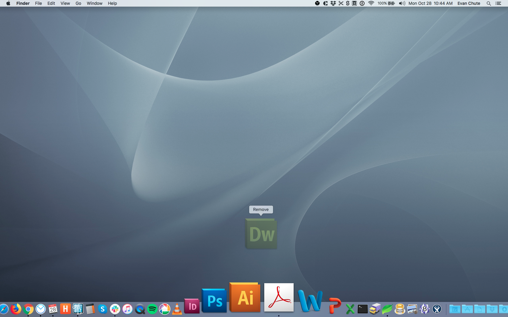

# UX/UI Design

So I was going through the notes of the UX/UI Design class I am taking, and this happened...

And I'm thinking, maybe I should stick those notes someplace I can find them easily? And in particular, I should put that list of resources somewhere I can easily find it. And yeah, I use the RTFM all the time, so here we are, posting screenshots of adding [Sketch](https://www.sketch.com/) to my dock.

This also happened, and it was pretty glorious...

