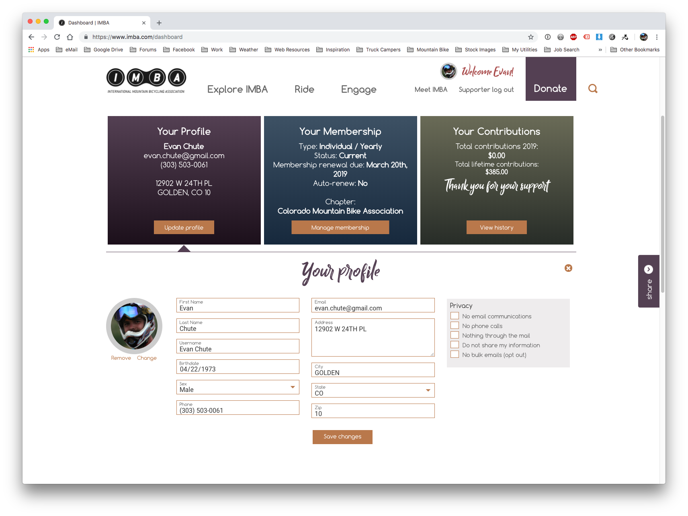
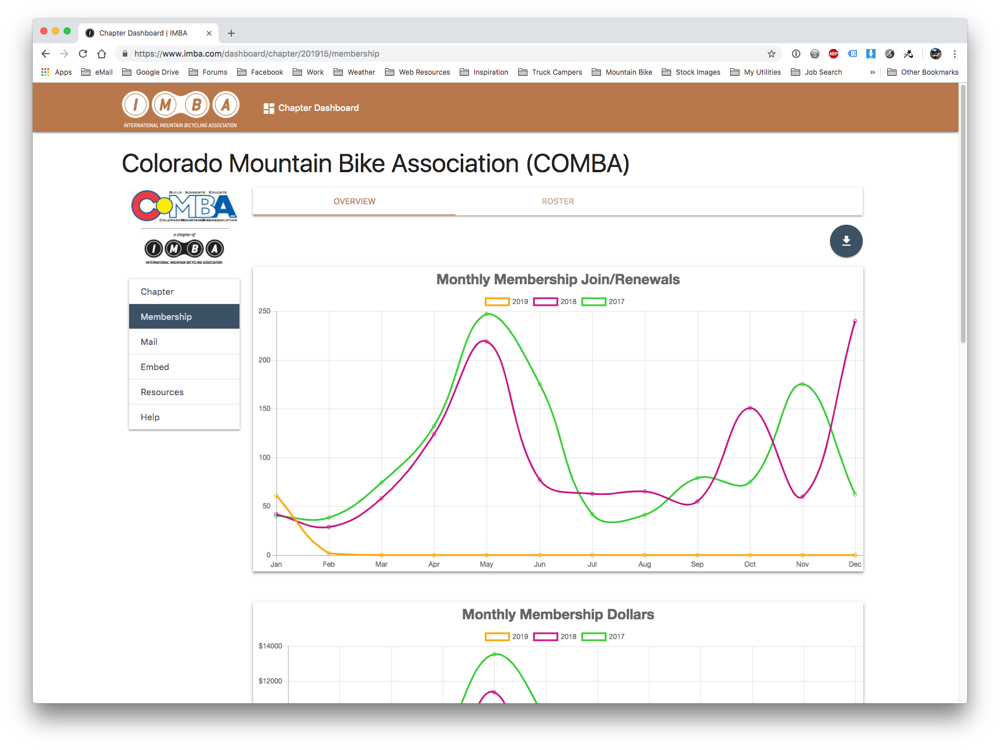

## General Notes

1. I didn't design or code this, that was done (so far as I know) by Dave Reedy (who I work with on occasion)
2. IMBA's CiviCRM is not integrated with their website, which is Drupal 8
3. Civi is hosted on www2.imba.com domain name, I assume this is a D7 instance?

### Chapter Dash Notes

1. Chapter Dash only shows for people how are somehow related to the Chapter, unsure if it's a CiviCRM Relationship or something else
2. The mailing segmenter thingy is pretty slick. I have no idea if it's going through CiviMail, though I assume it is based on the fact that I can see pre-dashboard mailings here.
3. We (as a chapter) have no access to the actual CiviCRM UI anymore, and as such the contact info we are able to see is super limited. 
4. We can get a mailing report of everyone a mailing was sent to, but if "The System" determines that they aren't and never have been a member, then their contact info is redacted. We only see the name.
5. Downloads of member lists are available, which is nice.

### Personal Dash Notes

1. Nice little section of documentation, built right in.
2. Contrib history and personal contact info update is nice
3. Manage Membership is neat, shows the member good info that isn't readily available using out of the box Drupal /user page functionality
4. Renew no just takes you to the join/renew page, super easy

## Screen Captures

### Update Profile

### Manage Membership

### View History

### Chapter Details

### Chapter Officers

### Membership Overview

### Membership Overview Dollars Graph

### Membership Roster

### Membership Roster Search

### Mail Triggered

### Mail Compose

### Mail History

### Chapter Dashboard Help

