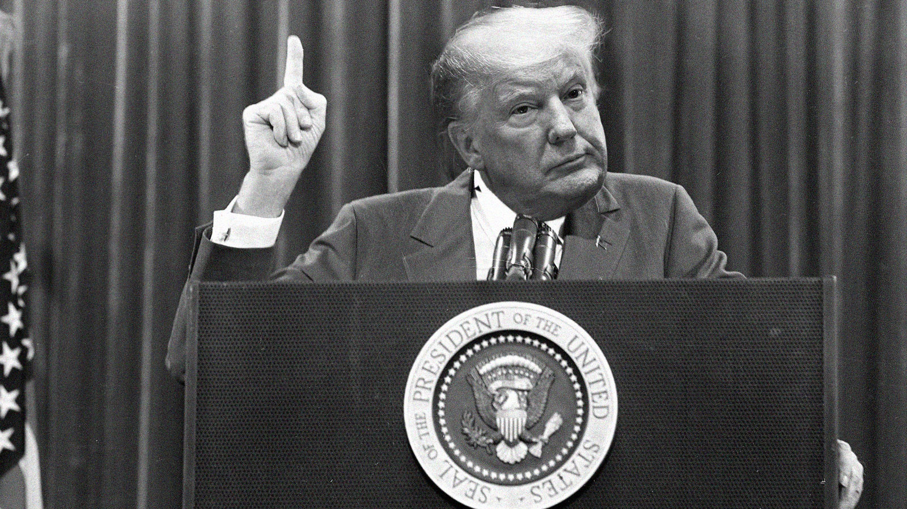

When troubleshooting problems in some code we were working on at my previous job, my boss would often tell me "When you hear hoofbeats, think of horses not zebras." This is an aphorism coined in the late 1940s by a medical professor in Maryland. The idea is that since horses are common in Maryland while zebras are relatively rare, logically one could confidently guess that an animal making hoofbeats is probably a horse. For those following along at home, the idea here is that the cause of the problem you are working on, be it a software glitch or a medical diagnosis, is more likely something common or obvious as opposed to complex, exotic, or rare.

I'd like to cordially suggest that during this time of political upheaval an uncertainty that we, as a country, take heed of this sage advice. While it may be tempting for some (though who you are, I cannot imagine) to entertain conspiracy theories, notions of a "deep state" coalition against conservatives, and various other mental gymnastics in an attempt to "prove" this administration's innocence... I say to you: Stop chasing zebras. 

Every witness, every document, every committee and agency report, tells a piece of the same story. Zero outliers, except for the president outright lying. Given the mounting body of evidence acquired at every step in this process,  isn't it far more likely that Mr. Trump is, to put it simply, a fucking criminal?

